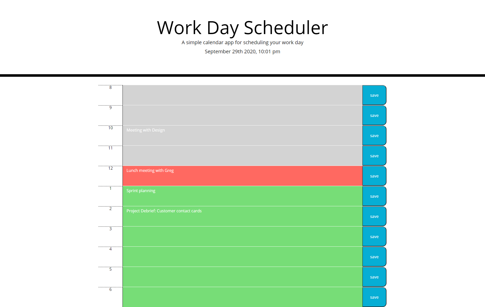
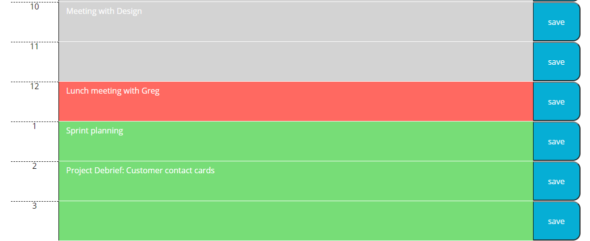

# Day Planner
livesite: https://ajm5099.github.io/Day-planner/ 

### Authors: 
Alex Milroy  
github: https://github.com/ajm5099/

## List of Contents

index.html  
script.js  
style.css  
README.md  
application.png  
schedule.png 

## Basic Overview of Project
The day planner is a lightweight javascript program that allows a user to plan their day. The application will accept and save inputs for each one hour time block, retaining them even after the browser is closed so suers can return to the page later and not lose any information. The application makes use of moment.js t oget the current time, and style each time row according to if its in the past, is the current time, or is in the future.

## User Stories
AS AN employee with a busy schedule
I WANT to add important events to a daily planner
SO THAT I can manage my time effectively

GIVEN I am using a daily planner to create a schedule
WHEN I open the planner
THEN the current day is displayed at the top of the calendar
WHEN I scroll down
THEN I am presented with timeblocks for standard business hours
WHEN I view the timeblocks for that day
THEN each timeblock is color coded to indicate whether it is in the past, present, or future
WHEN I click into a timeblock
THEN I can enter an event
WHEN I click the save button for that timeblock
THEN the text for that event is saved in local storage
WHEN I refresh the page
THEN the saved events persist

## Screenshot of Website

## Resources and Technologies Used

Joe Rehfuss for aid in project structure. In addition, curation of focus and project direction.

Dennis Molloy, Joanna Preston, Aslan Ghodsian, Katia Gilligan: TA's and tutors who helped solve styling, and primarily the dynamic use of javascript to create elements on the page without the use of starter HTML

Chris Wright, for help with local storage, and using the current time to style the page
  
Moment.js

Github

Visual Studio Code
 